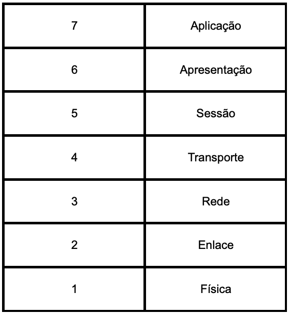
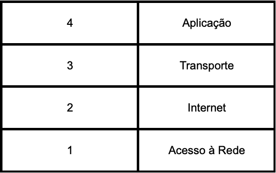
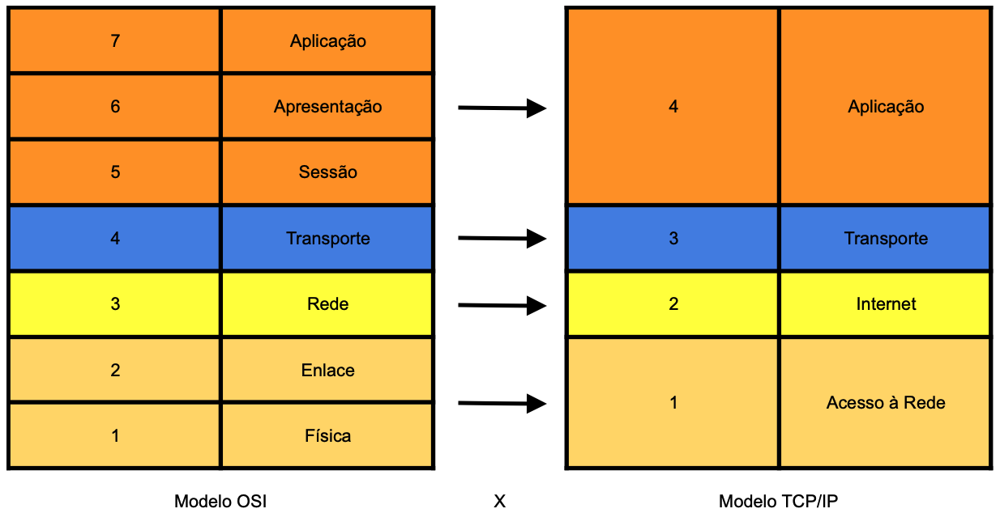
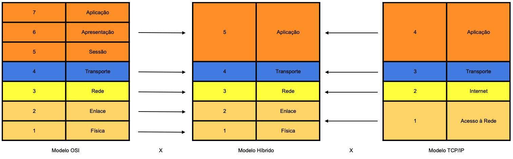
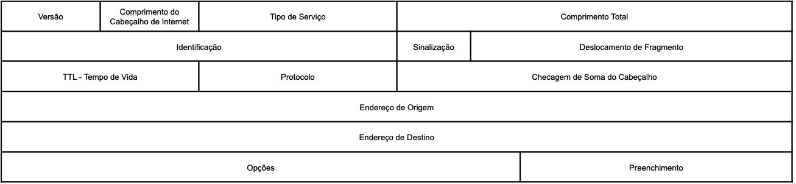

# Protocolo IP

## Introdução

Nesse artigo exploraremos o protocolo IP, vamos observar parte do contexto histórico e entender a sua importância, apresentar uma visão geral das funcionalidades e posteriormente nos aprofundar nos detalhes.

Vamos começar pelo início de tudo, durante o período da Guerra Fria, que ocorreu entre os Estados Unidos da América e a União das Repúblicas Socialistas Soviéticas, mas não vamos nos aprofundar no conflito, somente no que aconteceu a partir dele para o desenvolvimento das redes de computadores como conhecemos atualmente.

A *ARPA* (*Advanced Research Projects Agency*, em português, Agência de Pesquisas em Projetos Avançados), tinha a necessidade de transmitir dados sigilosos entre as suas bases militares e departamentos de pesquisa. A partir dessa necessidade houve o surgimento da *ARPAnet* (ARPA Network, em português, Rede da ARPA), uma rede de comunicação que também incluía universidades e algumas empresas privadas, formando um grupo de trabalho chamado de *ARPANET Network Working Group*.

Muitos dos protocolos e tecnologias que utilizamos hoje em dia para nos comunicar têm sua origem na ARPAnet, que começou modesta, e com o tempo, mais instituições se conectaram através de linhas telefônicas dedicadas.

Inicialmente o protocolo padrão para a internet era chamado de NCP (Network Control Program, Programa de Controle de Rede), mas com surgimento de outras redes ao redor do mundo foram experimentados problemas de compatibilidade para os protocolos existentes, levando ao desenvolvimento de uma nova arquitetura chamada de modelo de referência TCP/IP que tem como ideias centrais:

- Permitir o roteamento entre redes diferentes
- Independência do hardware
- Recuperação de falhas

Para um melhor entendimento do artigo, agora vamos conhecer um pouco dos modelos de referência para redes de computadores.

## Modelos de Referência para Redes de Computadores

### Modelo OSI

O modelo *OSI* (Open Systems Intercommunication, em português, Intercomunicação de Sistemas Abertos) foi desenvolvido pela ISO (International Organization for Standardization, em português, Organização Internacional de Padronização) a partir da necessidade de padronização dos hardwares e protocolos. No início, cada fabricante seguia um padrão proprietário, o que dificultava e até mesmo impossibilitava a comunicação entre equipamentos de diferentes fabricantes. Dessa forma, o modelo OSI foi proposto para preencher essas lacunas tendo como principais objetivos:
1. Garantir a comunicação fim-a-fim
2. Permitir a comunicação entre dispositivos de diferentes fabricantes
3. Definir regras para a construção das redes de computadores independentemente da tecnologia e do alcance geográfico
4. Facilitar o aprendizado da arquitetura das redes
5. Permite que novas tecnologias sejam facilmente implantadas e atualizadas

O modelo OSI é estruturado em 7 camadas:
1. Física: especificações elétricas e mecânicas, representação dos bits.
2. Enlace de Dados: controle de acesso ao meio físico.
    * Subnível inferior (MAC): controle de acesso ao meio.
    * Subnível superior (LLC): controle lógico do enlace.
3. Rede: roteamento dos pacotes, endereçamento IP, protocolos como ARP e RARP.
4. Transporte: transporte confiável e eficiente entre dispositivos.
    * Protocolos orientados a conexão (TCP).
    * Protocolos não confiáveis e não orientados à conexão (UDP).
5. Sessão: estabelecimento e gerenciamento de sessões entre aplicações.
6. Apresentação: conversão de formatos de dados, compactação e criptografia.
7. Aplicação: interface de interação entre usuário e máquina, protocolos como HTTP, SMTP, FTP.

Os protocolos são associados às camadas de acordo com as suas funcionalidades.

### Modelo TCP/IP

O Modelo TCP/IP é composto por uma pilha com camadas interativas, onde cada camada interage com a camada superior e inferior de forma hierárquica, isso significa que protocolos de camadas superiores dependem das inferiores.

Camadas do Modelo TCP/IP:
1. Acesso à Rede: Fornece suporte para todos os padrões proprietários.
2. Internet (ou Rede): Suporta o Protocolo de Internet (IP). Exemplos de Protocolos: ARP, RARP e ICMP.
3. Transporte: Gerencia a sessão de comunicação entre computadores. A camada de Transporte faz o uso dos Protocolos TCP (Transmission Control Protocol) e UDP (User Datagram Protocol).
4. Aplicação: Protocolos de aplicativos TCP/IP e interface entre usuário e aplicação. Exemplos de Protocolos: HTTP, SMTP, FTP, SSH, etc.

### Comparações entre o Modelo OSI e o Modelo TCP/IP

Semelhanças: Camadas de Transporte têm a mesma função nos dois modelos.
Diferenças: Camada de Enlace do TCP/IP combina funcionalidades das camadas de Enlace e Física do OSI. Camada de Aplicação do TCP/IP combina funcionalidades das camadas de Aplicação, Apresentação e Sessão do OSI.
Deficiência do OSI: Complexidade de implementação e repetição de funcionalidades.
Deficiência do TCP/IP: Falta de clareza em conceitos e não abrangência de outras pilhas de protocolos.

Por esses motivos, Andrew S. Tanenbaum, pesquisador e professor em ciência da computação, propôs um modelo híbrido de 5 camadas. Ele é também autor de livros sobre sistemas operacionais, sistemas distribuídos e redes de computadores. O objetivo desse modelo é aprimorar as deficiências do modelo TCP/IP e eliminar os excessos presentes no modelo OSI.

## Problemas resolvidos pela pilha de protocolos TCP/IP

Passamos por diversos assuntos, para facilitar a compreensão, principalmente de quem está nos estágios iniciais.

A princípio, os principais problemas a serem resolvidos eram:
1. Desperdício de recursos
2. Dificuldade de escalar os serviços
3. Falta de resiliência

Agora, para entendermos melhor, vamos voltar um pouco no tempo e ver como a comunicação era realizada.

Vamos observar primeiro o que é a comutação por circuitos. No início, os serviços de rede utilizavam canais dedicados e, para ter acesso a esses serviços, era criado um circuito, ou seja, para que fosse realizada a comunicação, era criado um caminho pré-definido entre o dispositivo de origem e o dispositivo de destino. Ao utilizar essa técnica, os recursos da rede ficavam alocados mesmo sem realizar troca de dados até que a conexão fosse encerrada.

Esses problemas foram resolvidos através da comutação por pacotes, mas agora precisamos entender o que são *pacotes*.

> Um pacote é a *unidade de dados de protocolo* (*PDU*, Protocol Data Unity) da camada de rede, mas podemos interpretar como uma mensagem, ou uma porção de uma mensagem maior, enviada pela rede.

Para entender o motivo da existência dos pacotes, precisamos fazer algumas reflexões, pensando bem, é totalmente inviável enviar arquivos completos através da rede, já parou para pensar no que acontece se houver um erro durante a transmissão de dados? A mensagem se perderia por completo e seria necessário reiniciar a transmissão do início e com isso, tempo e recursos foram desperdiçados, o prejuízo seria imenso. Para lidar com esse problema, os dados são fragmentados em partes menores e são enviados através da rede. Nesse primeiro momento, é importante sabermos que existem duas formas dos dados serem enviados, com garantia de entrega e sem garantia de entrega.

Vamos realizar um exercício de imaginação. Nesse exemplo, vamos utilizar o método de transmissão com garantia de entrega. Suponhamos que você possua pequenos envelopes que comportam apenas cartões e precisa enviar uma carta a um amigo, você terá que dividir essa carta em pequenas partes, sinalizando a sequência das mensagens para que o seu amigo possa recompor as mensagens recebidas através dos cartões e com isso, ler a mensagem original, observe que, ao individualizar as pequenas mensagens, não temos garantias de que essas pequenas mensagens seguirão pelo mesmo caminho até chegarem no destino, nem sequer se serão recebidas em ordem, acabamos de descrever como é o funcionamento básico da comutação por pacotes.

Atualmente, os serviços de rede não criam canais dedicados para realizar a transmissão de dados. Tenho que dizer que essa é uma meia-verdade, mas esse é um assunto para tratarmos em um artigo exclusivo. Em resumo, um pacote, é, na maior parte do tempo, um fragmento de uma mensagem e que é transmitido individualmente, sem uma rota pré-definida até o destino e possui a vantagem de não ocupar o canal de comunicação em períodos de ociosidade. Caso alguma rota falhe, os pacotes podem tomar caminhos alternativos, minimizando os períodos de interrupções. Como não há circuitos *dedicados*, a rede consegue lidar com um volume muito maior de operações simultâneas.

## Conclusão

Depois de tudo que foi apresentado, você deve estar se perguntando: "Afinal, por que o protocolo IP foi desenvolvido?"

> O protocolo IP foi projetado para o uso em sistemas baseados em comutação de pacotes e o seu escopo é atender as necessidades básicas para entregar dados partindo de uma origem em direção a um destino.

O protocolo IP implementa duas funções básicas: *endereçamento* e *fragmentação*.

É importante observarmos que o protocolo IP não possui alguns mecanismos importantes, como garantir a confiabilidade de dados, controle de fluxo, sequenciamento ou correção de erros. Essas responsabilidades são delegadas para as camadas de transporte e de enlace de dados.

Os cabeçalhos possuem informações para transmitir pacotes aos respectivos destinos. A seleção de um caminho para realizar a transmissão é chamado de *roteamento*.

> Roteamento: processo de realizar a comunicação entre redes diferentes. Esse processo é feito através de interfaces chamadas de **gateways**, que podemos vê-los como portões de saída de uma rede em direção a outras redes, mas ele é mais que isso, o gateway é quem tem a responsabilidade de saber os caminhos para realizar o encaminhamento dos pacotes. Como eu sou nerd, vou usar ***O Senhor do Anéis*** como referência e eu acho impossível alguém reclamar de spoiler, pois o último filme é de 2003... Frodo e Sam precisavam ir até Mordor para destruir o *Um Anel*, em determinado momento Sméagol cruzou o caminho deles e os guiou até o destino, podemos dizer que por conhecer as rotas até Mordor, Sméagol era o que podemos chamar de um gateway no contexto de redes de computadores, *não vou usar imagens porque não sei se posso*.

O Protocolo IP, utiliza campos no cabeçalho da internet para fragmentar e reagrupar *datagramas*, quando necessário para a transmissão de dados.

> Datagramas são unidades de transferência básica que fornecem serviço de comunicação não-confiável em redes comutadas por pacotes. Simplificando, podem ser vistos como entidades únicas, sem conexões ou circuitos lógicos.

O protocolo IP opera em cada host e gateway para interpretar campos de endereço, fragmentar e montar datagramas, tomar decisões de roteamento e outras funções.

O IP usa quatro mecanismos principais para desempenhar a sua função:

1. **Tipo de Serviço:** É um conjunto de parâmetros que define a qualidade do serviço desejado na rede. Isso ajuda os gateways a escolherem os parâmetros de transmissão ideais ao rotear um pacote na Internet.
2. **TTL / Time to Live / Tempo de Vida:** Indica o limite máximo de vida útil de um pacote na Internet. Se esse limite for atingido (chegar a zero), o pacote é descartado. Funciona como uma "autodestruição" do pacote após certo tempo para evitar que o pacote fique vagando pela rede.
3. **Opções:** Oferecem funções de controle adicionais para situações específicas, como carimbos de tempo, segurança e roteamento especial. Geralmente não são usadas em comunicações cotidianas.
4. **Checksum do Cabeçalho:** Serve para proteger os campos do cabeçalho da internet contra erros de transmissão. Se o checksum falha, o pacote é descartado. Erros são relatados por meio do Protocolo ICMP (Internet Control Message Protocol).

Esse artigo tem um caráter mais introdutório e mesmo assim ficou maior do que eu imaginava, alguns temas vão ficar para outras publicações, a ideia é detalhar os campos do cabeçalho IP, como funciona o endereçamento e como o protocolo se relaciona com as camadas de transporte e de enlace de dados.