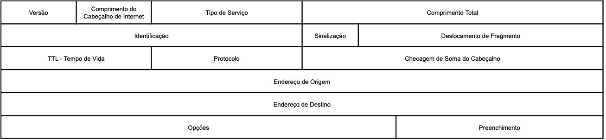

# Protocolo IP

## Introdução

Nesse artigo iremos explorar o protocolo IP, vamos observar parte do contexto histórico e entender a sua importância, apresentar uma visão geral das funcionalidades e posteriormente nos aprofundar nos detalhes.

Vamos começar pelo início de tudo, lá na Guerra Fria, que ocorreu entre os Estados Unidos da América e a União das Repúblicas Socialistas Soviéticas, mas não vamos nos aprofundar no conflito, somente no que aconteceu a partir dele para o desenvolvimento das redes de computadores como conhecemos atualmente.

A *ARPA* (*Advanced Research Projects Agency*, em português, Agência de Pesquisas em Projetos Avançados), tinha a necessidade de transmitir dados sigilosos entre as suas bases militares e departamentos de pesquisa. A partir dessa necessidade houve o surgimento da *ARPAnet* (ARPA Network, em português, Rede da ARPA), uma rede de comunicação que também incluía universidades e algumas empresas privadas, formando um grupo de trabalho chamado de *ARPANET Network Working Group*.

Muitos dos protocolos e tecnologias que utilizamos hoje em dia para nos comunicar têm sua origem na ARPAnet, que começou modesta mas, com o tempo, mais instituições se conectaram através de linhas telefônicas dedicadas.

Inicialmente o protocolo padrão para a internet era chamado de NCP (Network Control Program, Programa de Controle de Rede), mas com surgimento de outras redes ao redor do mundo foram experimentados diversos problemas de compatibilidade para os protocolos existentes, levando ao desenvolvimento de uma nova arquitetura chamada de modelo de referência TCP/IP que tem como ideias centrais:

- Permitir o roteamento entre redes diferentes
- Independência do hardware
- Recuperação de falhas

Para um melhor entendimento do artigo, agora vamos conhecer um pouco dos modelos de referência para redes de computadores.

## Modelos de Referência para Redes de Computadores

### Modelo TCP/IP

O Modelo TCP/IP é composto por uma pilha com camadas interativas, onde cada camada interage com a camada superior e inferior de forma hierárquica, isso significa que protocolos de camadas superiores dependem das inferiores.

Camadas do Modelo TCP/IP:
1. Acesso à Rede: Fornece suporte para todos os padrões proprietários.
2. Internet (ou Rede): Suporta o Protocolo de Internet (IP). Exemplos de Protocolos: ARP, RARP e ICMP.
3. Transporte: Gerencia a sessão de comunicação entre computadores. A camada de Transporte faz o uso dos Protocolos TCP (Transmission Control Protocol) e UDP (User Datagram Protocol).
4. Aplicação: Protocolos de aplicativos TCP/IP e interface entre usuário e aplicação. Exemplos de Protocolos: HTTP, SMTP, FTP, SSH, etc.

### Modelo OSI

É o modelo de referência desenvolvido pela ISO (International Organization for Standardization, em português, Organização Internacional para Padronização) e tem como objetivos:
* Comunicação fim-a-fim
* Comunicação entre os diferentes fabricantes existentes no mercado
* Regras de construção de redes
* Facilitar o aprendizado
* Permitir implantação de novas tecnologias

O modelo em questão é estruturado em 7 camadas:
1. Física: especificações elétricas e mecânicas, representação dos bits.
2. Enlace de Dados: controle de acesso ao meio físico.
    * Subnível inferior (MAC): controle de acesso ao meio.
    * Subnível superior (LLC): controle lógico do enlace.
3. Rede: roteamento dos pacotes, endereçamento IP, protocolos como ARP e RARP.
4. Transporte: transporte confiável e eficiente entre dispositivos.
    * Protocolos orientados a conexão (TCP).
    * Protocolos não confiáveis e não orientados a conexão (UDP).
5. Sessão: estabelecimento e gerenciamento de sessões entre aplicações.
6. Apresentação: conversão de formatos de dados, compactação e criptografia.
7. Aplicação: interface de interação entre usuário e máquina, protocolos como HTTP, SMTP, FTP.

Protocolos específicos são associados a cada camada para realizar suas funcionalidades.

### Comparações entre o Modelo OSI e o Modelo TCP/IP

Semelhanças: Camadas de Transporte têm a mesma função nos dois modelos.
Diferenças: Camada de Enlace do TCP/IP combina funcionalidades das camadas de Enlace e Física do OSI. Camada de Aplicação do TCP/IP combina funcionalidades das camadas de Aplicação, Apresentação e Sessão do OSI.
Deficiência do OSI: Complexidade de implementação e repetição de funcionalidades.
Deficiência do TCP/IP: Falta de clareza em conceitos e não abrangência de outras pilhas de protocolos.
Por esses motivos, um modelo híbrido de 5 camadas foi proposto por Tanenbaum para melhorar o modelo TCP/IP e retirar os excessos do modelo OSI.

## Conceitos importantes

Mas afinal, do ponto de vista técnico, por que o protocolo IP foi desenvolvido?

A princípio, um dos principais problemas a serem resolvidos, era evitar o desperdício de recursos. Antes da criação da comutação de pacotes, a comutação era realizada através de circuitos, que ao iniciar a comunicação entre uma origem e um destino, era criado um canal de comunicação dedicado e que consumia recursos da rede mesmo sem estar em uso, já na comutação por pacotes não é criado um canal de comunicação dedicado, os pacotes são transmitidos individualmente, sem uma rota pré-definida até o destino e possuem a vantagem de não ocupar o canal de comunicação em períodos de ociosidade.

> 💡 O protocolo IP foi projetado para o uso em sistemas baseados em comutação de pacotes e o seu escopo é atender as necessidades básicas para entregar dados partindo de uma origem em direção a um destino.

É importante observarmos que o protocolo IP não possui alguns mecanismos importantes, como garantir a confiabilidade de dados, controle de fluxo, sequenciamento ou correção de erros. Essas responsabilidades são delegadas para os vizinhos presentes nas camadas de transporte e de enlace de dados.

O exemplo abaixo demonstra de forma simplificada a relação entre o protocolo IP e os protocolos das camadas adjacentes, imagine que um módulo TCP utilize o módulo de internet para enviar um segmento TCP (incluindo o cabeçalho TCP e os dados do usuário) como parte do pacote de internet:

1. O módulo TCP forneceria os endereços e outros parâmetros no cabeçalho de internet como argumentos para o módulo de internet (Camada de Transporte).
2. O módulo de internet então criaria o pacote de internet e chamaria a interface de rede local para transmiti-lo (Camada de Enlace).

> 💡 O protocolo IP implementa duas funções básicas: endereçamento e fragmentação.

- Endereçamento: os endereços IPv4 possuem 32 bits, separados em 4 octetos e não utiliza o sistema de classes de endereçamento desde a década de 90, por esse motivo a única importância é apenas o conhecimento histórico.
- Fragmentação: os pacotes são divididos em fragmentos, quando necessário, para serem transmitidos através de uma rede.

Os cabeçalhos possuem informações para transmitir pacotes aos respectivos destinos e a seleção de um caminho para realizar a transmissão é chamado de roteamento.

O Protocolo IP, utiliza campos no cabeçalho da internet para fragmentar e reagrupar datagramas quando necessário para a transmissão e os datagramas são vistos como entidades únicas, sem conexões ou circuitos lógicos.

O protocolo IP opera em cada host e *gateway* para interpretar campos de endereço, fragmentar e montar datagramas, tomar decisões de roteamento e outras funções.

O IP usa quatro mecanismos principais para desempenhar a sua função:

1. **Tipo de Serviço:** É um conjunto de parâmetros que define a qualidade do serviço desejado na rede. Isso ajuda os gateways a escolher os parâmetros de transmissão ideais ao rotear um pacote na Internet.
2. **Tempo de Vida:** Indica o limite máximo de vida útil de um pacote na Internet. Se esse limite for atingido (chegar a zero), o pacote é descartado. Funciona como uma "autodestruição" do pacote após certo tempo.
3. **Opções:** Oferecem funções de controle adicionais para situações específicas, como carimbos de tempo, segurança e roteamento especial. Geralmente não são usadas em comunicações cotidianas.
4. **Checksum do Cabeçalho:** Serve para proteger os campos do cabeçalho da internet contra erros de transmissão. Se o checksum falha, o pacote é descartado. Erros são relatados por meio do Protocolo ICMP (Internet Control Message Protocol).

> 💡 Gateway: em resumo, a função de um gateway é realizar a comunicação entre redes diferentes, sejam essas redes internas ou externas.